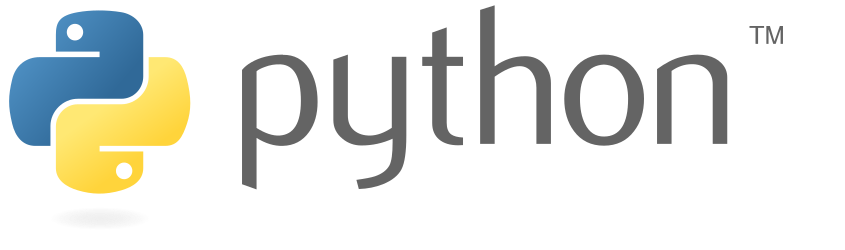
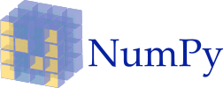
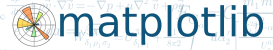
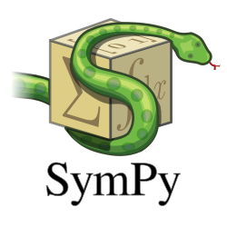
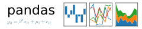

## Introducción a la Programación en Python

Bienvenidos a la iteración 2019 del curso **Introducción a la Programación Científica en Python**. El curso es intensivo de una semana 
y se realizará entre el **07 y el 11 de Enero del 2018** en el **laboratorio LC-304** de la Facultad de Ciencias Físicas y Matemáticas de la UdeC. El horario de la mañana es de **09:00 a 12:30** y el de la tarde de **14:30 a 18:00**.

El curso entrega las bases para poder utilizar el lenguaje de programación Python en al ámbito científico. Con los aprendizajes alcanzados el estudiante podrá analizar datos experimentales y computacionales haciendo uso de las herramientas escritas para Python y de esa forma aportar a una interpretación más completa de sus resultados de investigación. 

La presentación introductoria está disponible [aquí](https://drive.google.com/open?id=12LZqsOCsxH7bX4PHM-m1WTQBcbVC8Ql_tRYQjHO7xZQ).

Programa:

